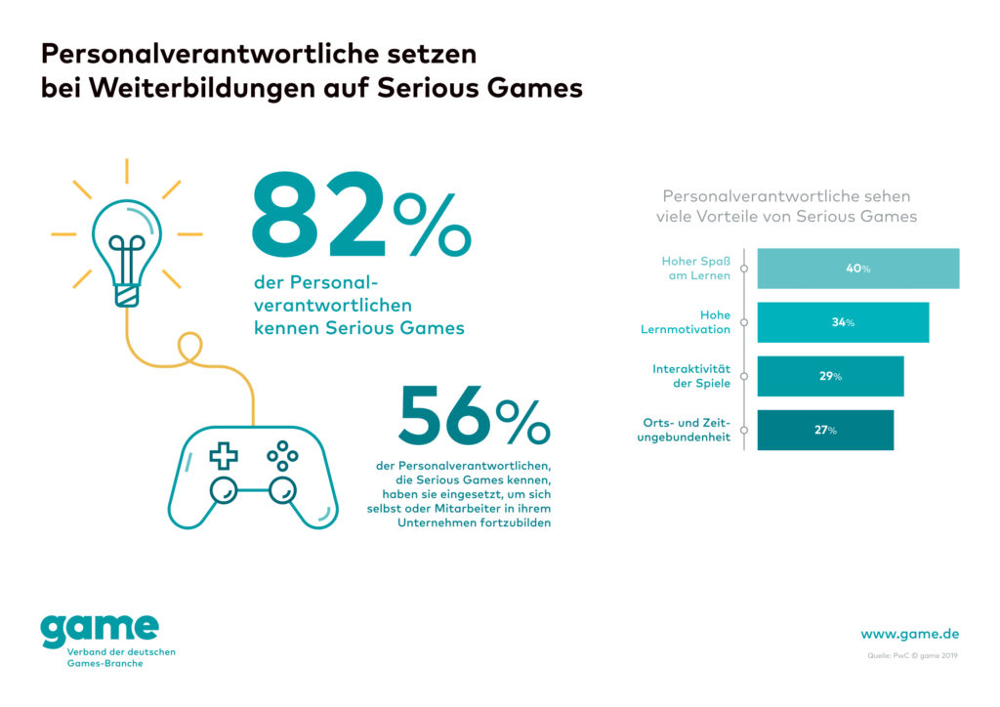

\clearpage

# Bachelor of Science in Gesundheit & Management für Gesundheitsberufe (B. Sc.)
Fachbereich Gesundheit & Soziales
Standort: Köln

Matrikel-No.: 400147257

Erstgutachter: Herr Dr. Robert Zickermann
Zweitgutachter: Herr Prof. Dr. Hans-Hermann Dirksen

Semester: SS 2019
11.06.2019

## Dissertation Titel

**BenBox.org** 
Untersuchung eines ‘Serious Game‘ in Bezug auf seinen Nutzen in der Gesundheitsförderung

# Zusammenfassung

Die vorliegende Arbeit beschäftigt sich mit dem Serious Game Prototypen BenBox.org,
ein Spiel für Kinder der Zielgruppe 6 bis 13 Jahre, in der Gesundheitsförderung im
deutschen eHealth-Markt. Der verwendete Prototyp, in Form eines Exergames, schult
über motorische Interventionen das Bewegungsverhalten der Nutzer. In seiner
erweiterten eLearning Funktion vermittelt das Serious Game über den Spielerzählstrang
Kenntnisse in Religions- und Geschichtswissenschaft.
Das Augenmerk dieser empirischen Arbeit liegt auf der ökonomischen Sinnhaftigkeit
dieses eHealth-Angebotes. Im Rahmen einer durchgeführten Umfrage, verknüpft mit
dem Spiele-Test des BenBox.org Prototypen, wurden Daten von Schülern einer dritten
Klasse erhoben. Die Kinder im Alter von acht und neun Jahren wurden in Paarungen an
einem iPad Pro mit dem Exergame konfrontiert und im Spielverlauf zu ihren Erfahrungen
befragt.

Der Nutzen digitaler Medien, insbesondere die ökonomische Betrachtung eines solchen
eHealth-Produktes, wird anschließend von Seiten des Vertriebsweges, der
Finanzierbarkeit und des Marketings reflektiert. Dazu werden die gesammelten
Umfrageergebnisse mit dem aktuellen wissenschaftlichen Diskurs verglichen, sowie die
gängigen ökonomischen Ansätze des Marktes betrachtet. Zu diesen Zwecken werden
die für digitale Produkte zurzeit verfügbaren Monetarisierungsstrategien,
Finanzierungsquellen, sowie Marketingstrategien sondiert, im Diskussions-Teil auf das
BenBox.org Spiel übertragen und daraus abgeleitet ein Finanzplan erstellt. Im
Schlussteil dieser Arbeit wird die konkrete zukünftige Realisation der anvisierten
technischen und monetären Ziele des Projektes beschrieben.

**Schlüsselwörter:** Serious Game, Exergame, Prototyp, Spiele-Test, Kinder,
Gesundheitsförderung, eHealth, eLearning, Umfrage, Ökonomie, Vertrieb, Finanzierung,
Marketing, Monetarisierungsstrategien, Finanzplan

# Abkürzungsverzeichnis

| Abkürzung | Bedeutung |
|---|---|
| eBooks | elektronische / digitale Bücher |
| eHealth | elektronische / digitale Gesundheitsprodukte |
| eLearning | digitales Lernen |
| GKV | Gesetzliche Krankenkassen |
| KI | Künstliche Intelligenz |
| NPC | Non-player character |
| PI | Persönliche Intelligenz |
| PKV | Private Krankenkasse |
| Prg | Paarung |
| Tablet | Tablet-Computer |
| TK | Techniker Krankenkasse |
| UI | User Interface |
| VR | Virtual Reality |
| ZPP | Zentrale Prüfstelle für Prävention |

# Abbildungsverzeichnis

| Abbildung | Seite |
|---|---:|
| Abb. 1.1: Serious Games für Weiterbildungen | S. 6 |
| Abb. 4.1: Durchschnittlicher App-Preis | S. 16 |
| Abb. 4.2: Durchschnittliche Spiele-Preise | S. 17 |
| Abb. 4.2.1: Angeborene Lernlust | S. 24 |
| Abb. 4.3.1: Produktion von Gesundheitsprodukten | S. 28 |
| Abb. 4.3.2.1: Budgetplan ‚Bolt Riley Episode 1‘ | S. 32 |
| Abb. 5.1: Item 1 | S. 35 |
| Abb. 5.2: Item 2 | S. 35 |
| Abb. 5.3: Item 3 | S. 36 |
| Abb. 5.4: Item 4 | S. 36 |
| Abb. 5.5: Item 5 | S. 36 |
| Abb. 6.1: Tabelle – Produktionskosten | S. 39 |
| Abb. 6.2: Tabelle – Kapitalquellen | S. 39 |

# 1. Einleitung

Digitalisierung und ihre Begleitthemen, wie Datenschutz, Big Data, Verschlüsselung, Blockchain, Cloud-Dienste, Deep Learning, Internet of Things (IoT), Augmented Reality und Virtual Reality (VR), Gamification, Robotik, Assistenz-Systeme wie z.B. Siri und autonomes Fahren, sowie Künstliche Intelligenz (KI) sind in aller Munde. Gerade das Thema der KI und das Drohen wegfallender Jobs wird zum emotional aufgeladenen Zukunftsszenario. Man geht davon aus, dass Berufe wie der des Versicherungsmaklers, eine Tätigkeit, die sich ausschließlich mit formalisierbaren Datensätzen beschäftigt, als erstes wegfallen und durch eine spezialisierte schwache KI ersetzt werden. Die starke KI, welche nicht nur für einen konkreten Anwendungsfall konstruiert ist und Intelligenz nicht einfach simuliert, sondern dem Menschen ebenbürtig, wenn nicht sogar überlegen ist, wird in absehbarer Zeit der Science-Fiction Literatur vorbehalten sein (Informatik und Gesellschaft, 2009). Nach Russel und Norvig (2009) sind die Kennzeichen für eine solche starke KI logisches Denken, Treffen von Entscheidungen bei Unsicherheit, Planen, Lernen, Kommunikation in natürlicher Sprache, sowie die Kombination all dieser Fähigkeiten zur Erreichung eines gemeinsamen Ziels. Persönliche Intelligenz (PI) ist nach von Reventlow und Thesen (2019) ein Assistenzsystems, dass dem Nutzer Vorschläge unterbreitet, ihn unterstützt und das Leben vereinfacht.
Land (2018) zufolge bewegt sich die Menschheit auf dem Weg zur Verwirklichung dieser Technologie durch fünf aufeinanderfolgende industrielle Phasen: Mechanisierung, Elektrifizierung, Automatisierung und Globalisierung, Digitalisierung und Vernetzung mit IoT, sowie schlussendlich die Entwicklung von cyberphysischen Systemen. Cyberphysische Systeme nutzen die Kooperation zwischen Mensch, Maschine und Künstlicher Intelligenz, um effektiv und effizient Prozesse der Herstellung oder Dienstleistung zu optimieren. Daher ist also nicht verwunderlich, dass sich auch die Gesundheitsanbieter, die bekanntlich mit knappen Ressourcen aus den Sozialtöpfen arbeiten müssen, ebenso mit Digitalisierung und der Verwendung von KI auseinandersetzen. Auch werden in diesem Bestreben immer mehr Mixed-Realtity-Umgebungen geschaffen. Dabei handelt es sich um die Verknüpfung von Elementen der virtuellen mit denen der realen Welt. Das kann z.B. ein realer Gegenstand sein, der zusätzlich in der virtuellen Welt abgebildet wird und sich dort ganz ähnlich verhält wie unter normalen physikalischen Bedingungen. Im medizinischen Bereich kann so z.B. das Erproben von Operationsverfahren ermöglicht werden. Diese Bestrebungen finden ihre Zusammenfassung in dem Begriff elektronische bzw. digitale Gesundheitsprodukte (eHealth).

Die neueste Version der Apple Watch kann seit März 2019 auch in Deutschland eine EKG-Messung durchführen und erfassen, ob ein normaler Sinusrhythmus vorliegt. Die von Stanford Medicine veröffentlichte Apple Heart Study belegt die Korrektheit der Daten der Apple Watch 4, die mittels Fingersensor EKG-Messungen durchführt. Hiermit durchdringt die Gesundheitsfürsorge letztendlich den Consumer Electronics Markt, also den hart umkämpften Absatzmarkt für elektronische Geräte, der bisher von großen Tech-Riesen wie Google, Microsoft, Samsung, und Apple dominiert wird. Die Digitalisierung der Medizin, mit Diensten wie der ‚Doc-on-Demand‘, einer Plattform, auf der ein Leistungserbringer zeit- und ortsunabhängig zum medizinischen Rat zur Verfügung steht, ist in den USA mit deutlichen Steigerungsraten versehen. Im Jahr 2015 verwendeten schon über 85% der niedergelassenen Ärzte und 90% der Kliniken digitale Patientenakten (Schmitt-Sausen, 2018). Die Zielgruppe dieser Technologien ist altersübergreifend. Auch für Kinder werden eine Vielzahl von elektronischen und digitalen Angeboten geschaffen. Einige davon versprechen digitale Lernförderung, welche unter dem Begriff eLearning zusammengefasst werden. Ebenso loben viele dieser Angebote aus, dass ihre Verwendung zur Gesundheitsprophylaxe dient. Diese Produkte für die junge Zielgruppe Kinder und Jugendliche, sind oftmals für mobile Endgeräte entwickelt und bieten nicht selten eine eigene Spielgeschichte mit Protagonisten. Diese Spielwelten sind häufig im Comic-Stil verfasst. Allerdings muss berücksichtigt werden, dass Kinder von den neuen Medien meist vor vollendete technische und erzählerische Tatsachen gestellt werden. Moderne Unterhaltungsmedien verlangen den jungen Menschen nicht selten sehr viel ab. Gerade bei spielerischen Inhalten findet meist in kurzer Zeit eine Menge an Handlung, die sogenannte ‚Action‘ statt. Diese kann vom Kind teilweise nur sehr schwer, wenn überhaupt, emotional verarbeitet werden (Daun, 2012). So steht die Frage im Raum, ob digitale Medien nutzbringend für die Gesundheitsvorsorge von Kindern eingesetzt werden können oder diese im schlechtesten Fall mit weiteren Stressoren belasten. Martin-Niedecken und Mekler (2018) konstatieren die weitläufige Verbreitung dieser Ansätze, geben jedoch zu bedenken, dass diese Technologien Schwächen aufweisen im Vergleich zu klassischen Angeboten. Schlüsselwörter im Bereich der motorischen Lernspiele seien ihnen zufolge ‚Embodiment‘ ‚Bodily Interplay‘ und ‚Presence‘. Diese Aspekte des menschlichen Lernens und der Entwicklung sind nicht zuletzt in den somatopädagogischen Disziplinen wie Feldenkrais, Eutonie Gerda Alexander und Qi-Gong relevant (Steinmüller, Schaefer & Fortwängler, 2009).

Wirtschaftlicher Erfolg ist gerade auch von Literatur und Unterhaltungsmedien der Kinder- und Jugendzielgruppe zu erwarten. Prominentes Beispiel ist die Fantasy-Kinderbuch-Reihe ‚Harry Potter‘. Bücher, Filme, analoge und digitale Spiele über den Zauberlehrling und seine Freunde, aus der Feder der britischen Autorin Joanne K. Rowling, generierten Milliardenumsätze. Untersuchungen zeigen, dass Kinder im Durchschnittsalter von neun Jahren ihr erstes ‚Harry Potter‘ Buch lasen. Über 50 % der Fünf- bis Siebzehnjährigen haben die Romane gelesen. Die Altersgruppen neun bis elf und 12 bis 14 Jahre sind die eifrigsten Leser und somit am stärksten für den Erfolg der Serie verantwortlich (Egger, 2009). Hinsichtlich der Digitalisierung, ist zu beobachten, dass alle großen Anbieter neben den klassischen Hörspielen insbesondere Spiele für Handy, Tablet-Computer (Tablet) und PC-System herausbringen, die dann zum Download verfügbar sind. Neben konventionellen Spielen werden digitale Medien auch zu Lernzwecken eingesetzt. Oftmals sind die Lerninhalte mit Gamification-Elementen angereichert, sodass eine durchgeführte Handlung in einer Belohnung in Form von Punkten und dergleichen mündet. Ist das digitale Medium jedoch grundsätzlich als Spiel konzipiert, vermittelt allerdings Wissen oder schult sinnvolles Verhalten, spricht man von einem Serious Game. Bei Spielen die überwiegend auf die körperliche Ertüchtigung abzielen auch von einem Exergame. Zuerst benutzte Clark Abt 1970 den Begriff Serious Game und beschrieb ihn mit „Nicht beabsichtigt um primär zum Vergnügen gespielt zu werden“ (Schmitt, Christopher, Tumanov, Weiss & Möckel, 2018). Kommen diese Sorte Spiele im Unternehmensumfeld zu Schulungszwecken zum Einsatz, ist von einem Corporate Game die Rede. Letzterer Begriff deutet darauf hin, dass Serious Games auch in Unternehmen eingesetzt werden, um Mitarbeiter mittels des gemeinsamen spielerischen Lernens, z.B. im Umgang mit Industrie-Applikationen oder in der Gesundheitsprophylaxe zu schulen. Wie in Abb. 1.1 zu ersehen, ist sich ein Großteil der Personalverantwortlichen der Existenz von Serious Games im Kontext des Lernens im Unternehmen bewusst, mehr als die Hälfte setzt diese Form der Edukation bereits ein.

Quelle: game – Verband der deutschen Games-Branche e.V., 2018
Bedarf besteht definitiv nicht nur in der Schulung in neuen Arbeitsmethoden, sondern auch in der Vorbeugung von Erkrankungen des Muskelskelettsystems. Laut der AOK sind 2015 ein Drittel der Patienten, die physiotherapeutische Behandlungen in Anspruch genommen haben, von Rückenschmerzen betroffen gewesen. 2011 gaben 65 % der Kinderärzte in einer Umfrage von Statista an, dass Kinder und Jugendliche in den letzten zehn Jahren mehr Rückenschmerzen beklagten. 88 % der Ärzte bemängelten darüber hinaus die sich verschlechternden koordinativen Fähigkeiten und sprachen von manifesten motorischen Defiziten. Im Hinblick auf diese Zahlen ist es verwunderlich, dass Kinder häufig in sportpädagogischen Gruppen und eher selten in therapeutischen Interventionen anzutreffen sind.

Die Boston Consulting Group hat in einer Studie die Region Köln-Bonn als Digital-Health-Cluster untersucht. Mit sechs Millionen Versicherten und einem starken Netzwerk an Gesundheitsdienstleistern, 57 Krankenhäusern, ~17.000 Betten und ~686.000 Patienteneinweisungen innerhalb von 35 km Radius im Jahr 2016 ist eine nennenswerte Gesundheits-Infrastruktur vorhanden. In Köln sind mehr als 650 Start-Ups und ca. 9.000 Beschäftigten sowie ca. eine Milliarde Euro Umsatz angesiedelt, unter ihnen auch erfolgreiche eHealth-Anbieter. Dies lässt im Hinblick auf die Vermarktung eines eHealth-Produktes auf ein probates Netzwerk hoffen. Die TU Darmstadt gilt in Deutschland als das Flaggschiff der Digitalforschung. Das Studienfach Multimedia Kommunikation, angesiedelt im Fachbereich Elektrotechnik und Informationstechnik, verfolgt die Vision der nahtlosen Kommunikation und erforscht auch vielfältige Ansätze im Bereich eHealth. So kommen zu den prognostizierten Wachstumsraten der Gesundheitsbranche im Digitalsektor auch die entsprechenden Fachkräfte auf den Markt.

Unter Berücksichtigung dieser Erkenntnisse und aktueller Forschungsergebnisse entsteht folgende Zielformulierung: Die vorliegende Arbeit soll den aktuellen eHealth Markt, im Besonderen den Gesundheits-Spielemarkt beleuchten, den Sachverhalt prüfen, ob das digitale Medium ‚Serious Game‘ in der Gesundheitsförderung von Kindern bisher eingesetzt wird, sowie ökonomisch erfolgversprechend vertrieben werden kann. Hierzu muss grundsätzlich die Frage erläutert werden, was die Gesundheit eines Kindes für einen monetären Wert hat, um eine betriebswirtschaftliche Perspektive zu schaffen.

# References

::: {#refs}
:::

